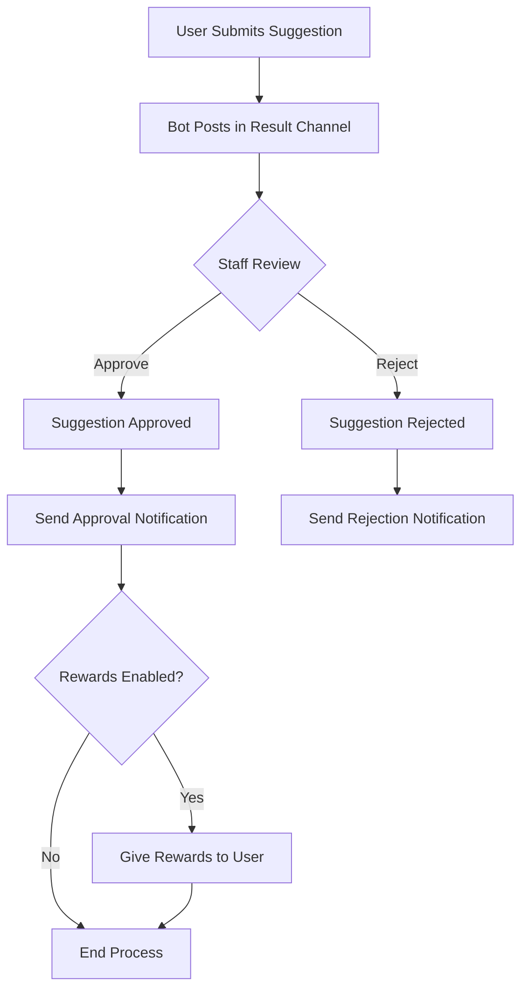

# 🔍 MineBot Suggestion System Guide

## Overview

The Suggestion System enables server members to submit ideas, feedback, and feature requests directly through Discord. Each suggestion can be reviewed, approved, or rejected by staff members. The system includes reward capabilities for suggestion submissions and utilizes Discord's interactive components for a seamless user experience.

## ✨ Key Features

- **Easy Submission Process**: Users submit suggestions via a Discord slash command and modal form
- **Staff Review Flow**: Moderators can approve or reject suggestions with feedback
- **Reward Integration**: Optionally reward users for submitting suggestions (Discord roles and Minecraft items)
- **Notification System**: Automatic notifications for submission and review status
- **Multi-language Support**: Fully translatable interface for international communities
- **Logging**: Comprehensive audit trail of all suggestion activity

## 🔄 How It Works



1. A user runs the `/suggest` command (or localized equivalent)
2. The bot presents a modal form for entering suggestion details
3. Upon submission, the suggestion appears in a designated channel
4. Staff members can review the suggestion with approve/reject buttons
5. The user receives notifications about their suggestion's status
6. If approved and rewards are enabled, the user receives configured rewards

## ⚙️ Configuration Guide

The suggestion system is configured in your settings.json file under the `commands.suggest` section:

```json
"suggest": {
  "enabled": true,
  "permissions": ["NONE"],
  "cooldown": {
    "algorithm": "fixed_window",
    "bucket": "user",
    "window_length": 60,
    "allowed_invocations": 1
  },
  "log": {
    "enabled": true,
    "channel": 1370801109395837110
  },
  "result_channel": 1370801109395837110,
  "reward": {
    "mode": "BOTH",
    "role": [1371228108598018089],
    "item": {
      "test1": ["give {minecraft_username} diamond 1"],
      "default": ["give {minecraft_username} apple 1"]
    }
  }
}
```

### Settings Explained:

| Setting          | Description                                 | Options                                   |
| ---------------- | ------------------------------------------- | ----------------------------------------- |
| `enabled`        | Toggles the entire suggestion feature       | `true` or `false`                         |
| `permissions`    | Required Discord permissions to use command | Array of permission names, or `"NONE"`    |
| `cooldown`       | Anti-spam settings for the command          | Object with algorithm and timing settings |
| `log.enabled`    | Enables logging of suggestion actions       | `true` or `false`                         |
| `log.channel`    | Discord channel ID for logging              | Valid channel ID number                   |
| `result_channel` | Channel where suggestions appear            | Valid channel ID number                   |
| `reward`         | Optional rewards for approved suggestions   | Object with role and item settings        |

## 🧩 Advanced Features

### Reward Integration

The suggestion system can automatically reward users whose suggestions are approved:

```json
"reward": {
  "mode": "BOTH",
  "role": [1371228108598018089],
  "item": {
    "test1": ["give {minecraft_username} diamond 1"],
    "default": ["give {minecraft_username} apple 1"]
  }
}
```

- `mode`: Set to `"ROLE"` for Discord roles only, `"ITEM"` for Minecraft items only, or `"BOTH"` for both
- `role`: Array of Discord role IDs to assign
- `item`: Minecraft commands to run per server, with variable replacement

### Variable Substitution

Your suggestion messages and rewards can include dynamic placeholders:

- `{discord_user_mention}` - Mentions the suggestion author
- `{discord_staff_user_mention}` - Mentions the staff member reviewing
- `{discord_staff_username}` - Username of reviewing staff member
- `{suggestion}` - The submitted suggestion text
- `{reason}` - The staff response/reason text
- `{minecraft_username}` - For users with linked accounts

## 📋 Localization

The suggestion system supports full localization through the language files:

```json
"suggest": {
  "command": {
    "label": "suggest",
    "description": "Suggest a feature."
  },
  "messages": {
    "minecraft": {
      "approve": {
        "text": "Your suggestion has been approved by {discord_staff_username}."
      },
      "reject": {
        "text": "Your suggestion has been rejected by {discord_staff_username}."
      }
    },
    // Other message configurations...
  },
  "menu": {
    "confirmation": {
      "approve": {
        "label": "Approve",
        "emoji": "✅",
        "style": "SUCCESS"
      },
      "reject": {
        "label": "Reject",
        "emoji": "❌",
        "style": "DANGER"
      }
    }
  },
  "modal": {
    "send": {
      "title": "Give a Suggestion",
      "fields": {
        "suggestion": {
          "style": "PARAGRAPH",
          "label": "Suggestion",
          "placeholder": "Enter your suggestion here."
        }
      }
    },
    "respond": {
      "title": "Respond to Suggestion",
      "fields": {
        "response": {
          "style": "PARAGRAPH",
          "label": "Response",
          "placeholder": "Enter your response here."
        }
      }
    }
  }
}
```

## 🔍 Troubleshooting

| Issue                          | Solution                                                       |
| ------------------------------ | -------------------------------------------------------------- |
| Command not showing up         | Verify `enabled` is set to `true` in configuration             |
| Users can't use the command    | Check `permissions` setting; ensure bot has proper permissions |
| Suggestions not appearing      | Confirm `result_channel` ID is correct and bot can post there  |
| Rewards not working            | Make sure users have linked their Minecraft accounts           |
| Staff can't review suggestions | Ensure they have proper Discord permissions                    |
